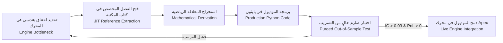
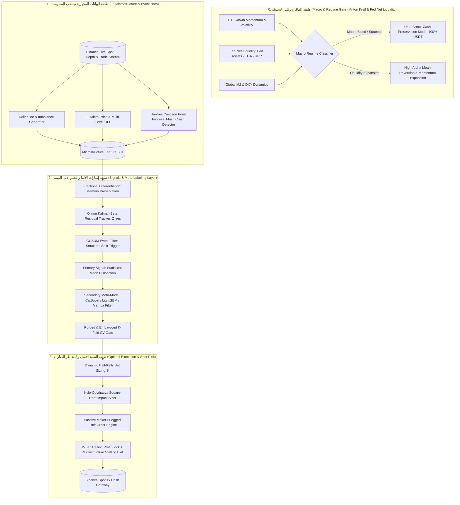

# 🧭 خارطة الطريق الكمية التجريبية الحديثة (v3.0 - Sovereign Edition)
# The Modern Empirical Quant Roadmap: Problem-Driven Engineering & Institutional Spot Alpha

> **"في أسواق التداول المؤسساتي، النظريات الأكاديمية المجردة هي مقبرة لرأس المال ما لم تصمد أمام فيزياء دفتر الأوامر اللحظية وتكاليف التنفيذ الحقيقية. العالم الكمي لا يقرأ الكتب بالترتيب الخطي ليحفظ المعادلات، بل يتعامل مع المكتبة كدليل صيانة تشريحي يُستدعى فوراً عند ظهور اختناق هندسي في محرك التداول."**
> 
> 👑 **المرجع الأعلى الشامل ودستور الحياة:** [The_Sovereign_Quant_Scientist_Master_Curriculum.md](file:///home/atheer/Desktop/ApexPredator/download%20data/The_Sovereign_Quant_Scientist_Master_Curriculum.md)

---

## 📑 الفهرس التنفيذي
1. [الميثاق العلمي: التمييز الصارم بين العلم الحقيقي والوهم الأكاديمي](#1-الميثاق-العلمي-التمييز-الصارم-بين-العلم-الحقيقي-والوهم-الأكاديمي)
2. [نموذج "الهندسة المدفوعة بالمشاكل" (Problem-Driven / Just-In-Time Engineering)](#2-نموذج-الهندسة-المدفوعة-بالمشاكل-problem-driven--just-in-time-engineering)
3. [المعمارية المؤسساتية المتكاملة لمحرك Apex Sovereign (4-Tier Engine)](#3-المعمارية-المؤسساتية-المتكاملة-لمحرك-apex-sovereign-4-tier-engine)
4. [الفهرس التشريحي: ربط مشاكل المحرك بكتب المكتبة الـ 15+ (JIT Index)](#4-الفهرس-التشريحي-ربط-مشاكل-المحرك-بكتب-المكتبة-الـ-15-jit-index)
5. [ميثاق التداول الحلال الصارم (100% Halal Spot 1x Cash Mandate)](#5-ميثاق-التداول-الحلال-الصارم-100-halal-spot-1x-cash-mandate)
6. [البروتوكول اليومي للبحث والتطوير (30% نظري / 70% كود واختبار)](#6-البروتوكول-اليومي-للبحث-والتطوير-30-نظري--70-كود-واختبار)
7. [معايير الاعتماد الإحصائي الصارم للقبول بالإنتاج (Production Acceptance Gate)](#7-معايير-الاعتماد-الإحصائي-الصارم-للقبول-بالإنتاج-production-acceptance-gate)

---

## 🔬 1. الميثاق العلمي: التمييز الصارم بين العلم الحقيقي والوهم الأكاديمي

لقد أثبتت التجربة العملية أن أكثر من 85% من الأبحاث المنشورة في التمويل الرياضي الكلاسيكي ومواقع التداول العامة تفشل فشلاً ذريعاً عند وضع دولار واحد حقيقي في السوق. هذا الجدول يفصل بشكل قاطع بين **العلم التجريبي المثبت الذي يعمل في الصناديق المؤسساتية** وبين **الضجيج الأكاديمي والتسويقي غير الفعال**:

| المحور | ❌ الوهم الأكاديمي والتجاري (لا يعمل - مقبرة رأس المال) | ✅ العلم التجريبي المؤسساتي المثبت (يعمل ويولد ألفا حقيقية) |
| :--- | :--- | :--- |
| **هيكلة الشموع والزمن** | الاعتماد على شموع الوقت الثابتة (1 دقيقة، 5 دقائق، ساعة). تسبب عدم استقرار التوزيع وتكدس التباين (*Heteroskedasticity*) وتجاهل سرعة وصول المعلومات. | **شموع المعلومات المتزامنة (Information Bars):** Dollar Bars و Volume Bars و Tick Imbalance Bars. تعيد التوزيع الطبيعي للعوائد وتتكيف لحظياً مع سرعة تدفق السيولة. |
| **المؤشرات الفنية (Indicators)** | RSI, MACD, Bollinger Bands, Moving Average Crossovers. معادلات متأخرة مشتقة خطياً من السعر السطحي، وتعتبر مصائد سيولة (*Liquidity Traps*) لصناع السوق لاصطياد الستوبات. | **فيزياء الميكروستركتشر (Microstructure Physics):** Order Flow Imbalance (OFI), Multi-Level Book Depth, Micro-Price (Stoikov), VPIN (Toxicity), Kyle’s Lambda. |
| **التنبؤ بالسلسلة الزمنية** | نماذج ARIMA / SARIMA / GARCH الكلاسيكية على إغلاقات الأسعار اليومية الخام، أو شبكات LSTM متدربة على سعر الإغلاق مباشرة. | **عمليات النقاط والتفرع الذاتي (Hawkes Processes):** نمذجة وصول الصفقات وتكدس الصدمات السعرية كعمليات إثارة ذاتية متفرعة تنبئ بانهيارات السيولة اللحظية. |
| **التحقق وتدريب النماذج** | Standard K-Fold Cross-Validation العشوائي. يتسبب في تسريب خطير للمعلومات من المستقبل للماضي (*Lookahead & Temporal Leakage*) ويصنع نتائج وهمية. | **التجزئة المطهرة والحظر الزمني (Purged & Embargoed Cross-Validation):** إلغاء التداخل الزمني بين مجموعات التدريب والاختبار وحجب فترة ارتداد الذاكرة. |
| **استقرار السلسلة الزمنية** | أخذ الفروق الصحيحة (First Differencing $d=1$) لتحقيق الاستقرار، مما يدمر 100% من ذاكرة السعر والاتجاه الكلي ويحول السلسلة لضجيج أبيض. | **التفاضل الكسري (Fractional Differencing $d \in [0.35, 0.55]$):** إيجاد الحد الأدنى $d^*$ الذي يتجاوز اختبار ADF ويحافظ على أقصى ذاكرة وارتباط بالسعر الأصلي. |
| **افتراض توزيع العوائد** | افتراض التوزيع الطبيعي الغاوسي (Gaussian Normal) وحركة براون المستمرة (Black-Scholes). يتجاهل القفزات والذيول السميكة (*Fat Tails*). | **توزيعات الذيول السميكة ونماذج القفزات (Jump Diffusions & Extreme Value Theory):** نمذجة الصدمات غير المتماثلة وحماية المحفظة من الانهيارات العنيفة. |
| **احتكاك التنفيذ (Execution)** | افتراض تنفيذ فوري مجاني دون انزلاق سعري (*Zero Friction & Zero Slippage Backtests*) على أسعار الإغلاق. | **نماذج الأثر السعري المؤسساتي (Kyle-Obizhaeva & Almgren-Chriss):** قانون الجذر التربيعي للأثر السعري، وتفضيل الأوامر السلبية (Passive Limit) لكسب السبريد وتفادي الاختيار العكسي. |
| **إدارة المخاطر والأنظمة** | وقف خسارة ثابت بنسبة مئوية عشوائية (مثلاً 2%) ومقاس صفقة ثابت، وتجاهل تغيير نظام السوق (*Regime Blindness*). | **فلتر كالبان للبيتا اللحظية + AR-HMM مع معامل هيرست ($H$):** تبديل نظام التداول آلياً بين الركود والترند، وتحديد حجم الصفقة بمعيار كيلي الكسري الديناميكي (*Half-Kelly*). |

---

## 🧠 2. نموذج "الهندسة المدفوعة بالمشاكل" (Problem-Driven / Just-In-Time Engineering)

### المنهج البديل: نظام الجراح (The Surgical Quant Approach)
نحن نقسم محرك التداول إلى **مكونات وظيفية (Engine Modules)**. عندما نصل لتطوير مكون معين أو نواجه اختناقاً (Bottleneck)، نذهب **مباشرةً إلى الكتاب المعني، نقرأ الفصل المحدد، نستخرج المعادلة، نبرمجها، ونختبرها في أقل من 48 ساعة**.



---

## 🏗️ 3. المعمارية المؤسساتية المتكاملة لمحرك Apex Sovereign (4-Tier Engine)

المحرك مصمم خصيصاً ليعمل وفق **قواعد التداول الفوري الحلال 1x Cash بدون رافعة مالية أو اقتراض أو بيع على المكشوف**:



---

## 📚 4. الفهرس التشريحي: ربط مشاكل المحرك بكتب المكتبة الـ 15+ (JIT Index)

| رقم | الاختناق الهندسي في محرك التداول (Engine Problem) | الكتاب المرجعي المحدد في المكتبة | الفصول والصفحات المفتاحية | المعادلة الرياضية الأساسية | المخرج البرمجي في `ApexPredator` |
| :---: | :--- | :--- | :--- | :---: | :--- |
| **P1** | تشوه التوزيع الإحصائي وفقدان إشارات التدفق في شموع الدقيقة | **Marcos López de Prado**<br>`Advances in Financial ML` | **الفصل 2:** Data Analysis with Alternative Bars (pp. 23–42) | $T = \inf \{t : \sum_{k=1}^t v_k p_k \ge \theta \}$ | `process_orderflow_bars.py`<br>توليد شموع الدولار بار $1M |
| **P2** | السعر المتوسط (Mid-Price) لا يعكس ضغط الطوابير ويتعرض للاختيار العكسي | **Larry Harris**<br>`Trading and Exchanges`<br>+ **Lehalle & Laruelle** | **Harris Ch. 4-5**<br>**Lehalle Ch. 2:** Order Flow and Price Formation | $P_{\text{micro}} = \frac{Q_{\text{bid}} P_{\text{ask}} + Q_{\text{ask}} P_{\text{bid}}}{Q_{\text{bid}} + Q_{\text{ask}}}$ | `apex_sovereign_engine/empirical_microstructure.py`<br>+ `l2_orderbook_analyzer.py`<br>حساب Micro-Price و OFI و OBI اللحظي |
| **P3** | الصفقات الكبيرة والانهيارات اللحظية تحدث في كتل متفرعة (Cascades) | **Cartea & Jaimungal**<br>`Algorithmic and HFT`<br>+ **Olivier Guéant** | **Cartea Ch. 6 & 10:** Hawkes Processes in Limit Order Books | $\lambda(t) = \mu + \sum_{t_i < t} \alpha e^{-\beta (t - t_i)}$ | `apex_sovereign_engine/empirical_microstructure.py`<br>+ `mega22_strategy.py` (Hawkes Cascade Shield) |
| **P4** | الأثر السعري وتآكل الأرباح بسبب الانزلاق (Slippage) ورسوم التيكر | **Barry Johnson**<br>`Algorithmic Trading & DMA`<br>+ **Olivier Guéant** | **Johnson Ch. 4:** Market Impact Models<br>**Guéant Ch. 2:** Avellaneda-Stoikov | $\Delta P \approx Y \cdot \sigma \cdot \sqrt{\frac{V_{\text{order}}}{V_{\text{daily}}}}$ | `optimal_execution_engine.py` / `optimized_maker_strategy.py`<br>تقطيع الأوامر بأوامر Limit صانعة للسوق |
| **P5** | تحويل السلسلة لعوائد يلغي الذاكرة التاريخية للاتجاه الكلي | **Marcos López de Prado**<br>`Advances in Financial ML` | **الفصل 5:** Fractionally Differentiated Features (pp. 75–88) | $(1-B)^d = \sum_{k=0}^{\infty} \frac{(-1)^k \Gamma(d+1)}{k! \Gamma(d-k+1)} B^k$ | `apex_sovereign_engine/empirical_microstructure.py`<br>حساب $d^*$ الأمثل لاختبار ADF وحفظ الذاكرة |
| **P6** | الدخول على كل بار يولد ضوضاء عالية واستنزافاً في العمولات | **Marcos López de Prado**<br>`Advances in Financial ML` | **الفصل 2:** The CUSUM Filter (pp. 38–41) | $S_t = \max(0, S_{t-1} + y_t - E[y_t])$ | `cusum_event_filter.py`<br>التقاط التحولات الهيكلية الحقيقية |
| **P7** | التسمية الكلاسيكية (Fixed Horizon) تتجاهل مسار السلوك داخل الصفقة | **Marcos López de Prado**<br>`Advances in Financial ML` | **الفصل 3:** The Triple-Barrier Method & Meta-Labeling | Barriers: $\{TP = +x\sigma, SL = -y\sigma, T_{\text{max}}\}$ | `meta_labeling_engine.py`<br>فصل اتجاه الصفقة عن حجمها وجودتها |
| **P8** | تسريب المستقبل والمبالغة الوهمية في معدل شارب في الباكتست | **Marcos López de Prado**<br>`Advances in Financial ML` | **الفصل 7:** Cross-Validation in Finance (Purged & Embargoed) | Purging overlapping test intervals + Embargo post-test | `purged_cv_evaluator.py`<br>التحقق الإحصائي الخالي من التسريب |
| **P9** | الوقوع في شراك السوق العرضي المتقلب وضياع الأرباح | **Kevin P. Murphy**<br>`Probabilistic ML (2022)`<br>+ `HMM في التداول الكمي` | **Murphy Ch. 17:** State-Space Models & Hidden Markov Models | $P(S_t | O_{1:t}) \propto P(O_t | S_t) \sum P(S_t | S_{t-1}) P(S_{t-1})$ | `regime_switching_hmm.py`<br>اكتشاف صندوق التذبذب $H < 0.5$ |
| **P10** | انحرافات الأسعار الفردية عن البيتكوين قد تكون ترنداً حقيقياً أو فجوة مؤقتة | **Michael Isichenko**<br>`Quantitative Portfolio Management`<br>+ **Ernest Chan** | **Isichenko Ch. 4-6:** Factor Models & Residual Dislocation | $y_t = \beta_t x_t + \epsilon_t, \quad Z_{\text{res}} = \frac{\epsilon_t}{\sigma_{\text{res}}}$ | `online_kalman_filter.py`<br>تتبع بيتا وانحراف الفجوة المعيارية |
| **P11** | مصفوفة التباين التجريبية مليئة بالضجيج تؤدي لانهيار أوزان المحفظة | **Marcos López de Prado**<br>`ML for Asset Managers (2020)` | **الفصل 2:** Denoising and Detoning Covariance Matrices (RMT) | $\lambda_{\max} = \sigma^2 (1 + \sqrt{N/T})^2$ | `rmt_denoiser.py`<br>تنقية المصفوفة بنظرية Marčenko-Pastur |
| **P12** | أوزان ماركويتز الكلاسيكية تركز المخاطر في أصول وهمية | **Marcos López de Prado**<br>`ML for Asset Managers (2020)` | **الفصل 7:** Hierarchical Risk Parity (HRP) | Quasi-diagonalization & Recursive Bisection | `hrp_portfolio_allocator.py`<br>توزيع المحفظة العنقودي بدون مصفوفة عكسية |
| **P13** | تدمير رأس المال بسبب حجم الصفقات العشوائي في صفقات غير متكافئة | **Abdullah Karasan**<br>`ML for Financial Risk`<br>+ **Annie Duke** | **Karasan Ch. 3:** Risk Metrics & Kelly Criterion | $f^* = \frac{p \cdot b - (1-p)}{b} \times \text{Safety Factor (0.5)}$ | `dynamic_half_kelly.py`<br>حجم المخاطرة المتناسب مع عمق الانحراف |
| **P14** | صدمات السيولة العالمية وتغير معدلات الفائدة تضرب الكريبتو بدون إنذار | **Ray Dalio**<br>`Principles for Big Debt Crises`<br>+ **Christopher Leonard** | **Dalio Part 1:** The Archetypal Debt Cycle & Liquidity Squeeze | Macro Inflow Index $\Delta M_2 + \Delta \text{Stablecoin Supply}$ | `macro_liquidity_shield.py`<br>فلتر الحماية من نزيف السيولة الكلي |
| **P15** | التذبذب الفعلي اللحظي يتطلب نمذجة رياضية لحساب سرعة التقلب | **Yacine Aït-Sahalia**<br>`High-Frequency Financial Econometrics` | **Ch. 3-4:** Realized Volatility & Jump Measurement | $RV_t = \sum_{i=1}^M r_{t,i}^2$ | `realized_volatility_jumps.py`<br>حساب التذبذب المجهري المنقى |

---

## ⚖️ 5. ميثاق التداول الحلال الصارم (100% Halal Spot 1x Cash Mandate)

يعمل هذا المحرك وفق ضوابط الشريعة الإسلامية الصارمة للتداول المالي:

1. **التداول الفوري الفعلي (100% Physical Spot Only):** التداول يقتصر حصراً على أزواج التداول الفوري المدعومة بالعملات الحقيقية (BTC/USDT, ETH/USDT, etc.).
2. **المنع المطلق للرافعة المالية والاقتراض الربوي (Zero Margin & Zero Leverage):** استخدام رأس المال النقدي الحقيقي فقط (1x Cash).
3. **المنع القاطع لعقود الفروقات والمشتقات المحرمة (Zero CFDs & Synthetic Derivatives):** منع تام للتعامل مع عقود الفروقات والخيارات غير المغطاة.
4. **المنع الصارم للبيع على المكشوف (Zero Short Selling):** لا بيع لما لا يملك المتداول؛ صفقات المحرك تعتمد 100% على الشراء الحقيقي (Spot Long) عند تشكل القاع الإحصائي، وتسييل المركز إلى النقد الحلال (USDT/USDC Cash).
5. **الميزة الاستراتيجية للنهج الحلال:** انعدام خطر التصفية الإجبارية (*Liquidation Risk = 0%*).

---

## ⏱️ 6. البروتوكول اليومي للبحث والتطوير (30% نظري / 70% كود واختبار)

```
┌──────────────────────────────────────────────────────────────────────────────┐
│                  بروتوكول العالم الكمي اليومي (Daily Research Loop)           │
├──────────────────────────────────────────────────────────────────────────────┤
│ 1. [07:00 - 08:30] الجلسة النظرية والرياضية (30% Theory & Math):             │
│    - دراسة الفصل المخصص واستخراج المعادلة بالورقة والقلم.                    │
├──────────────────────────────────────────────────────────────────────────────┤
│ 2. [09:00 - 11:30] الجلسة الهندسية والتكويد (Code Construction):            │
│    - برمجة دالة بايثون نظيفة وموجهة بمتجهات NumPy / Polars.                  │
├──────────────────────────────────────────────────────────────────────────────┤
│ 3. [14:00 - 15:30] جلسة التفنيد والاختبار الصارم (Empirical Verification):    │
│    - اختبار الدالة بـ Pytest وعلى بيانات خارج العينة والتأكد من خلو التسريب.  │
├──────────────────────────────────────────────────────────────────────────────┤
│ 4. [16:00 - 17:00] التوثيق واعتماد القرار (Lab Journaling & Merge):          │
│    - تسجيل النتيجة في سجل السبرنت وإجراء الـ Commit.                         │
└──────────────────────────────────────────────────────────────────────────────┘
```

---

## 🛡️ 7. معايير الاعتماد الإحصائي الصارم للقبول بالإنتاج (Production Acceptance Gate)

1. **معامل الارتباط التنبؤي (Information Coefficient):**
   $$\text{IC} = \text{Corr}(\text{Signal}_t, \text{Forward Return}_{t+k}) \ge 0.03 \quad (\text{مع } p\text{-value} < 0.01)$$
2. **معدل شارب المطهر (Purged CV Sharpe Ratio):**
   $$\text{Sharpe}_{\text{Purged CV}} \ge 1.8 \quad (\text{بعد خصم عمولة بينانس 0.075% والانزلاق السعري})$$
3. **أقصى هبوط تاريخي (Maximum Drawdown):**
   $$\text{Max Drawdown} \le 8.0\% \quad (\text{على بيانات اختبار تمتد لسنة كاملة على الأقل})$$
4. **عامل الربحية (Profit Factor):**
   $$\text{Profit Factor} = \frac{\sum \text{Gross Profits}}{\sum \text{Gross Losses}} \ge 1.40$$
5. **خلو تام من تسريب المستقبل (Zero Lookahead Proof):**
   * الفلترة والتوحيد المعياري يُحسب فقط على النوافذ المتوسعة السابقة (*Expanding Windows*).
