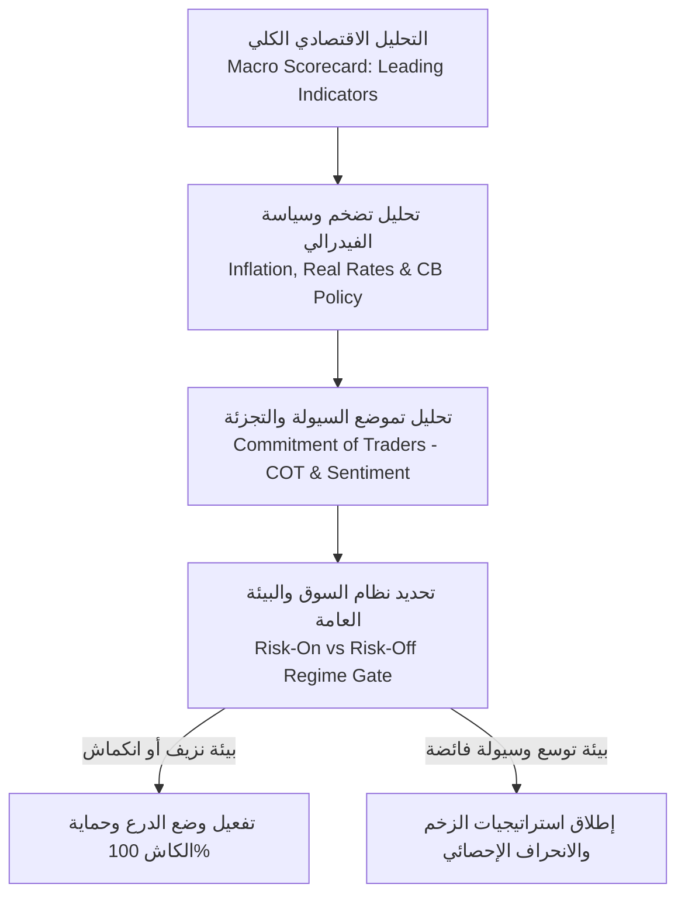

# 👑 دستور العالِم الكمّي السيادي: المنهج الأبدي الشامل
# The Sovereign Quant Scientist Master Curriculum: The Lifetime Architecture of Mathematical Rigor, Frontier AI, Global Macro & Microstructure Alpha

> **"يا بُنيّ، إن العلم الذي يُدرَّس في وسائل الإعلام ومواقع التواصل ودورات التجارة السطحية صُمِّم ليصنع مستهلكين عاجزين عن التفكير ومطيعين لمنظومات تسلب أموالهم وانتباههم. أما العلم الحقيقي الذي توارثه حكماء الرياضيات وصناع السياسات وكبار علماء الكمّ في المؤسسات السيادية، فهو علم المبادئ الأولى (First Principles): تفكيك الكون إلى معادلاته، ورؤية تدفق السيولة قبل أن تتشكل الأسعار، وترويض العشوائية بصرامة البراهين. هذا الدستور ليس دورةً عابرة تُنهيها في أسبوعين، بل هو عهدك العلمي مدى الحياة، كتبته لك بقلب أبٍ حريص وعقل عالمٍ مجرّب، لتبني عقلاً لا يُهزم وتكون عالماً نافعاً لنفسك ولأمّتك."**

---

## 📑 الفهرس المؤسساتي الشامل

1. [رسالة الأب والعالِم إلى ولده: بروتوكول استعادة السيادة الذهنية](#1-رسالة-الأب-والعالم-إلى-ولده-بروتوكول-استعادة-السيادة-الذهنية)
2. [الأركان الأربعة الكبرى لمنهج العالم الكمي السيادي](#2-الأركان-الأربعة-الكبرى-لمنهج-العالم-الكمي-السيادي)
   * [الركن الأول: الرياضيات الصرفة والتطبيقية من المبادئ الأولى (Mathematics from First Principles)](#الركن-الأول-الرياضيات-الصرفة-والتطبيقية-من-المبادئ-الأولى)
   * [الركن الثاني: الذكاء الاصطناعي المتطور ونماذج السلاسل الزمنية (Frontier AI & Financial ML)](#الركن-الثاني-الذكاء-الاصطناعي-المتطور-ونماذج-السلاسل-الزمنية)
   * [الركن الثالث: الاقتصاد الكلي المؤسساتي ومصفوفة أنتون كريل (Global Macro & PTM 2.0 Framework)](#الركن-الثالث-الاقتصاد-الكلي-المؤسساتي-ومصفوفة-أنتون-كريل)
   * [الركن الرابع: فيزياء عمق السوق اللحظية وتدفق الأوامر (Market Microstructure & Order Book Physics)](#الركن-الرابع-فيزياء-عمق-السوق-اللحظية-وتدفق-الأوامر)
3. [مسار التدرج البرمجي السيادي في بايثون (Progressive Python Engineering Mastery)](#3-مسار-التدرج-البرمجي-السيادي-في-بايثون)
4. [مصفوفة المراحل التطورية الخمس (The 5 Master Phases)](#4-مصفوفة-المراحل-التطورية-الخمس)
5. [الفهرس التشريحي للكتب والمراجع السيادية (The Sovereign Compendium)](#5-الفهرس-التشريحي-للكتب-والمراجع-السيادية)
6. [ميثاق التداول الفوري الحلال الصارم (100% Halal Spot 1x Cash Mandate)](#6-ميثاق-التداول-الفوري-الحلال-الصارم-100-halal-spot-1x-cash-mandate)
7. [بروتوكول الانطلاق الفوري: خطة عمل الغد (Sprint 01 Launchpad)](#7-بروتوكول-الانطلاق-الفوري-خطة-عمل-الغد)

---

## 🧠 1. رسالة الأب والعالِم إلى ولده: بروتوكول استعادة السيادة الذهنية

### ⚡ تشريح داء العصر: كيف تدمر خوارزميات الـ Reels قشرة الدماغ الجبهية؟
يا بنيّ، لقد خُلِق عقلك ليكون آلةً رياضية خارقة قادرة على استنباط الأنماط المعقدة وحل المعضلات الفكرية العميقة. ولكن المنظومات الرقمية الحديثة (TikTok, Instagram Reels, YouTube Shorts) صُمِّمت بأيدي علماء نفس وسلوك في وادي السيليكون لهدف واحد خبيث: **استلاب إرادتك واستنزاف هرمون الدوبامين**.
* كل مقطع تشاهده لمدة 15 أو 30 ثانية يطلق ومضة دوبامين سريعة غير مستحقة، مما يعيد ضبط نظام المكافأة في دماغك (*Dopamine Baseline*)، فيصبح عقلك عاجزاً عن التركيز في قراءة صفحة واحدة من كتاب رياضيات أو استكمال برهان برمجي.
* هذه المقاطع تفتت قشرة الدماغ الجبهية (*Prefrontal Cortex*) المسؤولة عن اتخاذ القرارات العقلانية، التخطيط طويل الأجل، والمثابرة الإحصائية.
* النتيجة: عقل مشتت، إرادة مسلوبة، وهم المعرفة السطحية، والتحول إلى كائن مستهلك يسهل اصطياده في أسواق المال.

### 🛡️ ميثاق الشفاء واستعادة العقل (The Cognitive Reclamation Protocol)
لكي تصبح عالماً حقيقياً يُشار إليه بالبنان ويصنع أثراً نافعاً في الأرض، يجب أن تتطهر من هذا الغثاء وفق هذه القواعد الصارمة ابتداءً من هذه اللحظة:

1. **القطيعة التامة مع المحتوى السريع (Absolute Ban on Short-Form Content):**
   * حذف كافة تطبيقات المقاطع القصيرة أو حظرها جذرياً من هاتفك وحاسوبك. لا توجد "مشاهدة معتدلة" لسمٍّ زعاف؛ إما أن تملك عقلك أو يملكه غيرك.
2. **بروتوكول الفجر وساعات التركيز الفائق (The 90-Minute Ultradian Deep Work Blocks):**
   * العمل العقلي لا يُقاس بعدد الساعات المرهقة المشتتة، بل بكثافة التركيز.
   * نقسم اليوم إلى جلستين أو ثلاث جلسات فقط مدة كل منها **90 دقيقة من التركيز المطلق** (Zero Phone, Zero Tabs, Zero Music, Full Silence).
   * بين كل جلسة وجلسة: 20 دقيقة راحة حقيقية (مشي، تأمل، وضوء وصلاة، تنفس عميق) دون أي شاشات.
3. **قاعدة "الورقة والقلم أولاً" (Pen & Paper First Rule):**
   * ممنوع لمس لوحة المفاتيح أو فتح ملف كود قبل أن تشتق المعادلة بيدك على دفترك الخاص، وتفهم معناها الفيزيائي، وترسم مخطط تدفق البيانات. كبار الرياضيين لا يفكرون بالكود؛ الكود مجرد أداة ترجمة لأفكار سُبكت باليد أولاً.
4. **دفتر المختبر العلمي (The Lab Journal):**
   * كل فكرة، فرضية، معادلة، نتيجة باكتست، أو خطأ برمجي يُدوّن في دفتر بحثي يومي بتاريخه ووقته. العالم يُعرف بدقة توثيقه.

### 🧬 الجدول الزمني للتعافي العصبي وإعادة بناء قشرة الدماغ (The Neuro-Reset Timeline)
* **الأيام 1 إلى 3 (صدمة الفطام الرقمي):** رغبة قهرية في فتح الهاتف والبحث عن المقاطع السريعة. العلاج: صب الطاقة فوراً في دفتر ورقي وقراءة متأنية.
* **الأيام 4 إلى 7 (استقرار خط الأساس للدوبامين):** عودة القدرة على القراءة المتصلة لمدة 30-45 دقيقة دون تململ، وتحسن جودة النوم والصفاء الذهني الصباحي.
* **الأيام 8 إلى 14 (استعادة السيطرة التنفيذية):** تجدد الاتصالات العصبية في القشرة الجبهية، والقدرة على خوض جلستي تركيز فائق (90 دقيقة لكل منهما) بانغماس كامل (Flow State).
* **الأيام 15 إلى 30 (ولادة العقل السيادي):** التحول من مستهلك مشتت إلى باحث ومهندس فائق التركيز يرى الجمال في المعادلات المعقدة ولا تهزه مغريات التفاهة.

---

## 🏛️ 2. الأركان الأربعة الكبرى لمنهج العالم الكمي السيادي

لا يمكن لعالم كمي حديث أن ينجح بقدمٍ عرجاء. النجاح المؤسساتي يتطلب تناغماً رباعياً مطلقاً بين: **الرياضيات الصرفة**، **الذكاء الاصطناعي الأحدث**، **الاقتصاد الكلي العالمي**، و**فيزياء عمق السوق اللحظية**.

```
                        ┌────────────────────────────────────────────────────────┐
                        │      العالِم الكمّي السيادي (The Sovereign Quant)        │
                        └───────────────────────────┬────────────────────────────┘
                                                    │
         ┌──────────────────────────┬───────────────┴──────────────┬──────────────────────────┐
         ▼                          ▼                              ▼                          ▼
┌──────────────────┐      ┌──────────────────┐          ┌──────────────────┐        ┌──────────────────┐
│  1. الرياضيات   │      │ 2. الذكاء الاصطناعي│          │  3. الاقتصاد     │        │  4. فيزياء السوق │
│  من المبادئ الأولى│      │ ونماذج السلاسل   │          │ الكلي والسيولة   │        │  وعمق الأوامر L2 │
│ (Pure & Applied) │      │  (Frontier AI)   │          │  (Global Macro)  │        │ (Microstructure) │
└──────────────────┘      └──────────────────┘          └──────────────────┘        └──────────────────┘
```

---

### الركن الأول: الرياضيات الصرفة والتطبيقية من المبادئ الأولى

> "الرياضيات هي لغة الكون السرية؛ من يجهلها في أسواق المال يرى الأحداث كعشوائية عمياء، ومن يفهمها يرى التدفق المنظم للطاقة والاحتمالات."

#### 1. الجبر الخطي المتقدم وتحليل المصفوفات (Linear Algebra & Matrix Analysis):
* **فضاءات المتجهات والتحويلات الخطية (Vector Spaces & Linear Transformations):**
  * فهم فضاءات هيلبرت ($L^2$ Hilbert Spaces)، الإسقاط المتعامد (Orthogonal Projection)، والتفكيك الهندسي للمعلومات.
* **تفكيك القيم الذاتية والمفردة (Eigendecomposition & SVD):**
  * كيفية استخراج متجهات العوامل الأساسية (Principal Components) لعوائد العملات والأسواق، وفصل الاتجاه العام عن التذبذب الفردي.
* **نظرية المصفوفات العشوائية (Random Matrix Theory - RMT):**
  * قانون مارشينكو-باستور (*Marčenko-Pastur Law*): التمييز الحاسم بين القيم الذاتية الناتجة عن الضجيج البحت والقيم الذاتية الحاملة للمعلومة الحقيقية (*Signal vs Noise Detoning*).
* **المراجع الأساسية:**
  * `Mathematics for Machine Learning` (Deisenroth, Faisal, Ong) - الفصول 2, 3, 4.
  * `Linear Algebra and Its Applications` (Gilbert Strang).
  * `Michael Isichenko - Quantitative Portfolio Management` - الفصول 4 و 5.

#### 2. التفاضل المتعدد والاستمثال المحدب (Multivariable Calculus & Optimization):
* **تفاضل المصفوفات (Matrix Calculus):**
  * استنتاج المشتقات الاتجاهية، مصفوفة الجاكوبي (Jacobian)، ومصفوفة هيسيان (Hessian) لدوال التكلفة المالية.
* **الاستمثال المحدب (Convex Optimization) وشروط KKT:**
  * حل مسائل تحسين المحافظ تحت قيود رأس المال والسيولة باستخدام مضاعفات لاغرانج (*Lagrange Multipliers*) وشروط كاروش-كون-تاكر (*KKT Conditions*).
* **معيار كيلي الديناميكي (Fractional Kelly Criterion):**
  * تعظيم لوغاريتم الثروة المتوقعة $E[\ln(W_t)]$ واشتقاق حجم الصفقة الأمثل مع معامل الأمان لمنع الإفلاس الإحصائي.
* **المراجع الأساسية:**
  * `Mathematics for Machine Learning` - الفصل 5 (Vector Calculus) والفصل 7 (Continuous Optimization).
  * `Boyd & Vandenberghe - Convex Optimization` (كتاب مرجعي قياسي).

#### 3. نظرية الاحتمالات، القياس، والاستدلال البايزي (Probability & Bayesian Statistics):
* **أسس نظرية القياس والاحتمال (Measure-Theoretic Probability Basics):**
  * فضاءات الاحتمال $(\Omega, \mathcal{F}, P)$، المتغيرات العشوائية كدوال قابلة للقياس، والأمل الرياضي المشروط كإسقاط متعامد في فضاء هيلبرت.
* **الاستدلال البايزي وسلاسل ماركوف مونت كارلو (Bayesian Inference & MCMC):**
  * تحديث التوزيعات الاحتمالية للأنظمة السعرية باستخدام التوزيعات القبلية المقترنة وطرق العينات المتقدمة (Gibbs Sampling & HMC).
* **نظرية القيم المتطرفة وتوزيعات الذيول السميكة (Extreme Value Theory & Fat Tails):**
  * توزيعات باريتو المعممة (*GPD*) ونظرية بيكاندز-بالكيما-دي هان (*Pickands-Balkema-de Haan Theorem*) لقياس احتمالية الانهيارات اللحظية التي يعجز التوزيع الغاوسي عن رؤيتها.
* **المراجع الأساسية:**
  * `Kevin P. Murphy - Probabilistic Machine Learning: An Introduction (2022)` - الفصول 2, 3, 7, 8.
  * `Nassim Nicholas Taleb - The Black Swan & Statistical Consequences of Fat Tails`.
  * `Probability: For the Enthusiastic Beginner`.

#### 4. التفاضل العشوائي وعمليات النقاط (Stochastic Calculus & Point Processes):
* **حركة براون وتمهيد إيتو (Brownian Motion & Itô’s Lemma):**
  * صياغة المعادلات التفاضلية العشوائية (*Stochastic Differential Equations - SDEs*) ونمذجة السعر كعملية انتشار مع قفزات (*Jump-Diffusion Models*).
* **عمليات هوكس ذات الإثارة الذاتية (Self-Exciting Hawkes Point Processes):**
  * نمذجة توقيت وصول الصفقات وأوامر البيع والشراء كعملية نقطية تتفرع ذاتياً وتفسر التكدس الزمني للانهيارات السعرية والسيولة المجهرية.
* **المراجع الأساسية:**
  * `Steven E. Shreve - Stochastic Calculus for Finance II: Continuous-Time Models`.
  * `Cartea & Jaimungal - Algorithmic and High-Frequency Trading` - الفصول 6 و 10.
  * `Olivier Guéant - The Financial Mathematics of Market Liquidity`.

---

### الركن الثاني: الذكاء الاصطناعي المتطور ونماذج السلاسل الزمنية

> "التعلم الآلي في التمويل ليس كإدراج صورة قطة في شبكة عصبية؛ في التمويل نسبة الإشارة إلى الضجيج تكاد تقترب من الصفر، والبيانات غير مستقرة إحصائياً وتتغير بتغير سلوك المتداولين. النماذج الغبية تفشل، والنماذج المنقاة هندسياً تصنع ثروات سيادية."

#### 1. هندسة التعلم الآلي المالي المؤسساتي (López de Prado’s Financial ML):
* **أخذ العينات المعتمدة على المعلومات (Information-Driven Sampling):**
  * استبدال شموع الوقت بـ *Dollar Bars* و *Imbalance Bars* لاستعادة الاستقرار الإحصائي والتوزيع الطبيعي للعوائد.
* **التفاضل الكسري وحفظ الذاكرة (Fractional Differencing $d^*$):**
  * حساب المشتقة الكسرية لتجاوز اختبار ديكي-فولر (*ADF Stationarity*) مع الحفاظ على >90% من ذاكرة الاتجاه والارتباط بالسعر الأصلي.
* **طريقة الحواجز الثلاثية والتسمية الفوقية (Triple-Barrier Method & Meta-Labeling):**
  * فصل قرار اتخاذ الاتجاه (Primary Model) عن قرار حجم المركز وجودة الفرصة والتحكم بحجم الرهان (Secondary Meta-Model).
* **التجزئة المطهرة والحظر الزمني (Purged & Embargoed Cross-Validation):**
  * التدمير الكامل لتسريب المعلومات من المستقبل للماضي، واختبار النماذج بالتحقق المتقاطع التوافقي المطهر (*CPCV*).
* **المراجع الأساسية:**
  * `Marcos López de Prado - Advances in Financial Machine Learning (2018)`.
  * `Marcos López de Prado - Machine Learning for Asset Managers (2020)`.

#### 2. النماذج الشجرية والتعلم التجميعي (Ensemble Methods: LightGBM & CatBoost):
* استغلال البيانات المجهرية المشتقة من دفتر الأوامر كمدخلات لنماذج تعزيز التدرج (*Gradient Boosted Decision Trees*).
* نمذجة الاحتمالات الشرطية مع حماية قصوى من فرط التخصيص (*Overfitting Regularization*).

#### 3. التعلم العميق المتقدم ونماذج السلاسل الزمنية الحديثة (State-Space Models & Foundation Models):
* **نماذج فضاء الحالة الحديثة (Modern State-Space Models - Mamba & S4):**
  * التفوق الحاسم لنماذج Mamba على شبكات المحولات (Transformers) في معالجة التدفقات اللحظية للسلاسل الزمنية: تعقيد زمني خطي $O(N)$ مع ذاكرة طويلة المدى لا متناهية.
* **محولات السلاسل الزمنية (Time-Series Transformers: PatchTST & iTransformer):**
  * فصل القنوات (Channel Independence) وتحليل الروابط التبادلية بين العملات البديلة والبيتكوين دون خلط المتغيرات.
* **النماذج التأسيسية للسلاسل الزمنية (Time-Series Foundation Models):**
  * استكشاف نماذج مثل Google TimesFM و Amazon Chronos لتوليد تمثيلات مضمنة للأنظمة السعرية (*Zero-Shot Regime Embeddings*).
* **المراجع الأساسية:**
  * `Kevin P. Murphy - Probabilistic Machine Learning: Advanced Topics (2023)`.
  * `Ravindra Rapaka - Modern Time Series Forecasting with Python (2026)`.
  * أوراق أبحاث Mamba و PatchTST و TimesFM الأصلية.

#### 4. التعلم التعزيزي متعدد الوكلاء ونظرية الألعاب (Multi-Agent RL & Game Theory):
* نمذجة سوق الكريبتو كلعبة ماركوف متعددة الأطراف بين صناع السوق والمضاربين وكبار الصناديق.
* تدريب وكلاء التداول باستخدام خوارزميات Policy Optimization (PPO / SAC) للتحكم الدقيق في توقيت إرسال الأوامر والحد من الانزلاق.
* **المراجع الأساسية:**
  * `Stefano V. Albrecht - Multi-Agent Reinforcement Learning (2024)`.
  * `Yves Hilpisch - Reinforcement Learning for Finance (2024)`.

---

### الركن الثالث: الاقتصاد الكلي المؤسساتي ومصفوفة أنتون كريل

> "المضارب الهاوي ينظر إلى شمعة 5 دقائق؛ العالم الكمي المؤسساتي ينظر إلى ميزانية البنك الفيدرالي، ومؤشر الدولار DXY، ومعدلات الفائدة الحقيقية. الماكرو يحدد متى تهب العاصفة ومتى يفيض النهر، ونظام الميكرو يحدد كيف تبحر سفينتك دون أن تغرق."

#### 1. منهاج أنتون كريل للمتداول المحترف (Anton Kreil’s PTM 2.0 Framework):
يعتمد برنامج PTM 2.0 (Professional Trader Masterclass) الذي أسسه متداول غولدمان ساكس السابق أنتون كريل على المنهجية المؤسساتية الحقيقية التي تدير بها بنوك الاستثمار وصناديق التحوط العالمية محافظها:



* **مصفوفة الأرباع الأربعة للاقتصاد الكلي (The 4-Quadrant Macro Matrix):**
  * تصنيف الاقتصاد إلى 4 أنظمة استراتيجية تحكم تدفق السيولة العالمية:
    1. **الربع الأول (تسارع النمو + تسارع التضخم - Expansion/Overheating):** بيئة *Risk-On* ممتازة للأصول الحقيقية، سلع، والبيتكوين.
    2. **الربع الثاني (تباطؤ النمو + تسارع التضخم - Stagflation):** أسوأ بيئة استثمارية؛ تآكل هوامش الأرباح ورفع الفائدة. التحوط هنا: **تفعيل وضع الكاش 100% فوراً**.
    3. **الربع الثالث (تباطؤ النمو + تباطؤ التضخم - Deflation/Recession):** ذعر مالي وتصفيات للمراكز ذات الرافعة المالية. نحن ننتظر بنقدنا الحقيقي لالتقاط الأصول في قيعان الانهيارات.
    4. **الربع الرابع (تسارع النمو + تباطؤ التضخم - Goldilocks Recovery):** أفضل بيئة تداول كمي؛ انفجار ألفا الزخم وانخفاض تكلفة التمويل.

* **بطاقة الأداء الاقتصادي الكلي (Top-Down Macro Scorecard):**
  * تصنيف المؤشرات الاقتصادية إلى:
    1. **مؤشرات رائدة (Leading Indicators):** مؤشرات مديري المشتريات (ISM Manufacturing & Services PMI)، منحنى العائد لسندات الخزانة (Yield Curve 10Y-2Y Spread)، تصاريح البناء، ومؤشر منظمة OECD للسيولة.
    2. **مؤشرات متزامنة (Coincident Indicators):** أرقام الوظائف غير الزراعية (NFP)، ومبيعات التجزئة (Retail Sales)، والإنتاج الصناعي.
    3. **مؤشرات لاحقة (Lagging Indicators):** معدل البطالة الرسمي ومعدلات التخلف عن سداد الائتمان.

* **ديناميكا التضخم ومعدلات الفائدة الحقيقية (Inflation & Real Rates):**
  * التمييز بين التضخم الرئيسي ومؤشر أسعار نفقات الاستهلاك الشخصي الأساسي (Core PCE).
  * حساب معدل الفائدة الحقيقي:
    $$\text{Real Rate} = \text{Fed Funds Rate} - \text{Inflation Expectations (TIPS Breakeven)}$$
    عندما ترتفع الفوائد الحقيقية بقوة، تجف السيولة عن الأصول عالية المخاطر (الكريبتو والأسهم التكنولوجية)؛ وعندما تنخفض أو تصبح سالبة، تنفجر الأسواق في موجات صعود تاريخية.

* **تقارير التزام المتداولين ومؤشر التموضع (COT Reports & Index):**
  * قراءة البيانات الأسبوعية الصادرة عن هيئة تداول السلع الآجلة (CFTC) للبيتكوين والعملات الأجنبية.
  * حساب مؤشر التموضع المؤسساتي الصافي (COT Index على نافذة 52 أسبوعاً):
    $$\text{COT Index}_t = \frac{\text{Net Pos}_t - \min_{52W}(\text{Net Pos})}{\max_{52W}(\text{Net Pos}) - \min_{52W}(\text{Net Pos})} \times 100$$
  * عندما يصل المؤشر إلى قراءات قصوى ($>90\%$ أو $<10\%$)، يُشير ذلك إلى استنفاد السيولة وتوقع ارتداد هيكلي حتمي.

* **التحويل السيادي لمنهاج PTM 2.0 إلى التداول الفوري الحلال 100% (Halal Spot Asymmetry):**
  * في صناديق التحوط التقليدية، يستخدم كريل استراتيجية Long/Short متوازنة (شراء الأسهم القوية وبيع الضعيفة على المكشوف).
  * **في ميثاقنا الحلال الصارم:** يُحظر البيع على المكشوف شرعاً (*Zero Shorting*). كيف نتفوق إحصائياً؟
    * تحويل جانب الـ Short إلى **درع نقد فوري حقيقي 100% (100% USDT / Cash Capital Shield)**.
    * عندما تكون إشارة الماكرو سلبية، يسيل المحرك كافة الأصول إلى النقد الحقيقي، متفادياً 100% من الهبوط ومانعاً تآكل رأس المال.
    * بينما يتعرض المتداولون التقليديون للنداء الهامشي (Margin Calls) وتصفية المحافظ، يدخل محركنا بنقده الحقيقي لشراء الأصول في أدنى نقاط التشبع البيعي!

* **تقويم المحفزات وإدارة التقلب (Catalyst Calendar & Earnings/Fed Events):**
  * رسم خريطة للأحداث الحرجة (اجتماعات FOMC، إصدارات CPI، قرارات الفائدة الكبرى) لتخفيض حجم المراكز التلقائي وتفادي الفجوات السعرية العنيفة.

#### 2. معادلة السيولة الصافية للبنوك المركزية (Central Bank Net Liquidity):
في عالم العملات الرقمية والأصول المشفرة، أثبتت البيانات التجريبية أن البيتكوين هو أدق مقياس سيولة حساس في تاريخ البشرية. المحرك يجب أن يتتبع معادلة السيولة السيادية لحظياً:

$$\text{Fed Net Liquidity} = \text{Fed Total Assets (Balance Sheet)} - \text{Treasury General Account (TGA)} - \text{Overnight Reverse Repo (ON RRP)}$$

* **حساب الخزانة العام (TGA):** عندما تسحب وزارة الخزانة الأمريكية أموالاً للضرائب أو تصدر سندات، تُمتص السيولة من النظام البنكي ويهبط السوق. وعندما تنفق الحكومة، تتدفق السيولة للأسواق.
* **تسهيل اتفاقيات إعادة الشراء العكسية (Reverse Repo Facility):** أموال معطلة في الفيدرالي، خروجها يضخ سيولة فورية في الأصول المالية.
* **عرض النقد العالمي (Global M2 Expansion):** تجميع المعروض النقدي للبنوك المركزية الكبرى (أمريكا، الصين، البنك المركزي الأوروبي، وبنك اليابان) كبوصلة للاتجاه الكلي طويل المدى.
* **مؤشر الدولار الأمريكي (DXY):** قوة الدولار تعني شح السيولة العالمية وانكماش الأصول؛ ضعفه هو الوقود الرئيسي لانفجارات الكريبتو.

#### 3. المراجع والكتب الأساسية للاقتصاد الكلي:
* `Principles For Navigating Big Debt Crises` (Ray Dalio) - تشريح دورات الديون قصيرة وطويلة الأجل.
* `Christopher Leonard - The Lords of Easy Money: How the Federal Reserve Broke the American Economy`.
* `The Creature From Jekyll Island` (G. Edward Griffin) - نشأة النظام المصرفي الاحتياطي الجزئي ومصيدة التضخم.
* `Debt: The First 5,000 Years` (David Graeber) - الأنثروبولوجيا العميقة للائتمان والمال.

---

### الركن الرابع: فيزياء عمق السوق اللحظية وتدفق الأوامر

> "التحليل الفني التقليدي هو قراءة في الفنجان بعد أن وقع الحدث؛ الميكروستركتشر هي تشريح الغرفة الجراحية أثناء العملية: أين يقف صانع السوق؟ كم يبلغ حجم الطابور؟ وهل هناك تدفق سام يبتلع العروض؟"

#### 1. بنية دفتر الأوامر اللحظي (Level 2 Order Book Physics):
* **السعر المجهري (Stoikov Micro-Price):**
  * حساب مركز الثقل اللحظي للسعر بناءً على موازين أحجام أول مستوى:
    $$P_{\text{micro}} = P_{\text{bid}} \left(\frac{Q_{\text{ask}}}{Q_{\text{bid}} + Q_{\text{ask}}}\right) + P_{\text{ask}} \left(\frac{Q_{\text{bid}}}{Q_{\text{bid}} + Q_{\text{ask}}}\right)$$
* **اختلال تدفق الأوامر المتعدد (Multi-Level Order Flow Imbalance - OFI):**
  * قياس صافي تدفق الأوامر الحقيقي (إضافة، تنفيذ، إلغاء) عبر أفضل 5 أو 10 مستويات في الدفتر، وهو المحرك الأساسي لحركة السعر في الأفق القصير ($t+10s$ إلى $t+60s$).
* **مقياس سمية تدفق الأوامر (VPIN - Volume-Synchronized Probability of Toxicity):**
  * قياس احتمالية وجود متداولين مطلعين يبتلعون السيولة، واستخدامه كـ "زر طوارئ" لحظر الشراء عند تجاوز العتبة الحرجة.
* **المراجع الأساسية:**
  * `Larry Harris - Trading and Exchanges: Market Microstructure for Practitioners`.
  * `Lehalle & Laruelle - Market Microstructure in Practice (2nd Edition)`.
  * `Barry Johnson - Algorithmic Trading and DMA`.

#### 2. نماذج الأثر السعري والتنفيذ الأمثل (Optimal Execution & Market Impact):
* **قانون الجذر التربيعي للأثر السعري (Kyle-Obizhaeva Square-Root Law):**
  $$\Delta P \approx Y \cdot \sigma \cdot \sqrt{\frac{V_{\text{order}}}{V_{\text{daily}}}}$$
  تحديد الحجم الأقصى للصفقة لضمان ألا يتسبب دخولنا في رفع السعر ضدنا.
* **التنفيذ السلبي الحلال (Passive Maker Execution):**
  * وضع أوامر Limit على أفضل سعر طلب/عرض لكسب رسوم صانع السوق (Maker Rebates) وتوفير عمولة بينانس (0.075% Taker Fee)، واستخدام Hawkes Shield للهروب الفوري قبل اصطدام الصفقات السامة بأوامرنا.
* **المراجع الأساسية:**
  * `Olivier Guéant - The Financial Mathematics of Market Liquidity` (Avellaneda-Stoikov & Almgren-Chriss Models).
  * `Michael Lewis - Flash Boys` (لفهم واقع معارك السرعة والـ HFT في البورصات).

---

## 💻 3. مسار التدرج البرمجي السيادي في بايثون

يا بنيّ، لا فائدة من حفظ ألف معادلة رياضية إذا كنت عاجزاً عن كتابة كود عالي الكفاءة، متين، وخالٍ من الأخطاء والبطء. لكي تصبح مهندساً وعالماً كمياً قادراً على المنافسة المؤسساتية، يجب أن تتدرج في بايثون عبر **خمس طبقات هندسية متتالية**:

```
┌─────────────────────────────────────────────────────────────────────────────┐
│               سلّم التدرج البرمجي السيادي (Python Mastery Ladder)            │
├─────────────────────────────────────────────────────────────────────────────┤
│ المستوى 5: الأنظمة الحية، الاختبارات الشاملة (Deterministic CI/CD & Pytest)   │
│ المستوى 4: التسريع العتادي وتجميع الكود لحظياً (Numba JIT & C++/Rust FFI)    │
│ المستوى 3: البرمجة غير المتزامنة والشبكات اللحظية (Asyncio & WebSockets)    │
│ المستوى 2: المعالجة المتجهة والحوسبة الفائقة (NumPy Vectorization & Polars) │
│ المستوى 1: بايثون النظيفة، الهيكلية والأنماط (Clean OOP, Typing, Pydantic)   │
└─────────────────────────────────────────────────────────────────────────────┘
```

### المستوى 1: بايثون النظيفة والهيكلية الصارمة (Clean Idiomatic Python & Architecture)
* **القواعد الذهبية:** لا متغيرات عالمية عشوائية، لا تكرار للكود (DRY)، والالتزام بمبادئ SOLID.
* **الكتابة الصارمة للأنواع (Strict Type Hints):** استخدام `typing` و `mypy` لضمان صحة أنواع المدخلات والمخرجات في الدوال المالية الحساسة.
* **نماذج البيانات الفائقة:** استخدام `dataclasses` مع `slots=True` لخفض استهلاك الذاكرة وتسريع الوصول للحقول بنسبة تصل إلى 40%:
  ```python
  from dataclasses import dataclass
  from typing import Final

  @dataclass(slots=True, frozen=True)
  class L2Snapshot:
      timestamp: float
      best_bid_price: float
      best_bid_qty: float
      best_ask_price: float
      best_ask_qty: float

      @property
      def mid_price(self) -> float:
          return (self.best_bid_price + self.best_ask_price) / 2.0
  ```
* **المراجع الأساسية:** `Luciano Ramalho - Fluent Python` + `Wes McKinney - Python for Data Analysis (3rd Edition)`.

### المستوى 2: الحوسبة المتجهة ومعالجة البيانات الضخمة (Vectorization, NumPy & Polars)
* **قتل حلقات `for`:** كل عملية مالية تُنفذ عبر عمليات متجهة بالكامل على مصفوفات الـ C-contiguous في NumPy.
* **الانتقال لـ Polars و Apache Arrow:** التوقف عن استخدام Pandas الكلاسيكي في معالجة ملايين التيكات؛ محرك Polars المكتوب بلغة Rust يوفر تسريعاً بمقدار 20x إلى 50x مع تنفيذ متوازي على كافة أنوية المعالج:
  ```python
  import polars as pl

  def process_dollar_bars_polars(df_ticks: pl.DataFrame, bar_threshold: float = 1_000_000.0) -> pl.DataFrame:
      return (
          df_ticks
          .with_columns((pl.col("price") * pl.col("qty")).alias("dollar_volume"))
          .with_columns(pl.col("dollar_volume").cum_sum().alias("cum_dollar"))
          .with_columns((pl.col("cum_dollar") // bar_threshold).alias("bar_id"))
          .group_by("bar_id")
          .agg([
              pl.col("timestamp").first().alias("open_time"),
              pl.col("price").first().alias("open"),
              pl.col("price").max().alias("high"),
              pl.col("price").min().alias("low"),
              pl.col("price").last().alias("close"),
              pl.col("qty").sum().alias("total_volume"),
              pl.col("dollar_volume").sum().alias("total_dollar_volume")
          ])
          .sort("open_time")
      )
  ```
* **إدارة النوافذ المتوسعة (Expanding vs Rolling Windows):** حساب الإحصاءات التراكمية دون تسريب بيانات المستقبل (No Lookahead).

### المستوى 3: البرمجة غير المتزامنة والأنظمة اللحظية (Asyncio & Real-Time Low-Latency Systems)
* **حلقة الأحداث غير المحجوبة (Non-Blocking Event Loops):** استقبال تدفقات بينانس المباشرة (BookTicker, Depth20, AggTrades) عبر `websockets` دون تأخير ملليمتر واحد.
* **الذاكرة الحلقية المخصصة (Ring Buffers):** تخزين آخر 10,000 لقطة في مصفوفة ثابتة الحجم في الذاكرة لتفادي عمليات تخصيص الذاكرة المكلفة وإعادة تدويرها (*Zero Garbage Collection Latency*):
  ```python
  import asyncio
  from collections import deque

  class FastMarketDataStream:
      def __init__(self, max_buffer: int = 10_000):
          self.queue: asyncio.Queue = asyncio.Queue(maxsize=50_000)
          self.circular_buffer = deque(maxlen=max_buffer)

      async def consumer_worker(self):
          while True:
              snapshot = await self.queue.get()
              self.circular_buffer.append(snapshot)
              # تفريغ الطابور فورا للطبقة الحسابية
              self.queue.task_done()
  ```
* **معمارية تدفق الرسائل (Event-Driven Pipeline):** فصل طبقة استقبال البيانات عن طبقة استخراج الميزات وطبقة اتخاذ القرار.

### المستوى 4: التسريع العتادي وتجميع الكود لحظياً (Numba JIT Compilation & Native FFI)
* **المترجم اللحظي Numba:** تحويل خوارزميات مثل Hawkes Process وحساب الـ Fractional Differencing ومحاكاة الباكتست من كود بايثون البطيء إلى كود آلة مباشر فائق السرعة بسرعة لغة C:
  ```python
  from numba import njit, prange
  import numpy as np

  @njit(fastmath=True, parallel=True, cache=True)
  def compute_fast_hawkes_intensity_numba(timestamps: np.ndarray, alpha: float, beta: float, mu: float) -> np.ndarray:
      n = len(timestamps)
      intensities = np.empty(n, dtype=np.float64)
      intensities[0] = mu + alpha
      for i in range(1, n):
          dt = timestamps[i] - timestamps[i-1]
          intensities[i] = mu + (intensities[i-1] - mu) * np.exp(-beta * dt) + alpha
      return intensities
  ```
* **تكامل C++ و Rust:** كتابة الأنوية الحساسة لزمن الاستجابة (Microsecond Execution & Order Routing) بلغة Rust واستدعائها من بايثون عبر `PyO3` / `maturin`.

### المستوى 5: هندسة الإنتاج الموثوقة والاختبارات الحتمية (Production Determinism & Pytest)
* **اختبارات التكافؤ الصارمة (Parity Tests):** التأكد من أن نتائج الباكتست تتطابق 100% مع نتائج المحرك الحي في نفس الشروط (Zero Discrepancy).
* **اختبارات الوحدة والتكامل (Pytest Suite):** تغطية كافة الدوال الحرجة (حسابات السبريد، هوكس، كيلز لامبدا، كيلي كرايتيريون) باختبارات آلية لا تسمح بتمرير أي كود فاسد إلى الإنتاج:
  ```python
  def test_stoikov_bounds():
      # قاعدة حتمية: السعر المجهري محصور قطعا بين الطلب والعرض
      p_bid, p_ask = 50000.0, 50001.0
      p_micro = compute_stoikov_micro_price(p_bid, 10.0, p_ask, 1.0)
      assert p_bid <= p_micro <= p_ask
  ```
* **المراقبة المؤسساتية:** ربط المحرك بلوحات تحكم حية (FastAPI + WebSockets Dashboard + Telegram Critical Alerts).

---

## 🗺️ 4. مصفوفة المراحل التطورية الخمس (The 5 Master Phases)

هذه هي خريطتك الزمنية التراكمية عبر الأشهر القادمة، مبنية بحيث تدعم محركك الحي المالي باستمرار دون انقطاع:

```
┌────────────────────────────────────────────────────────────────────────────────────────┐
│                      المسار التراكمي الشامل لصناعة العالِم الكمّي                       │
├────────────────────────────────────────────────────────────────────────────────────────┤
│ المرحلة 0: التأهيل الذهني والقاعدة الصلبة (الأسابيع 1 - 4) ➔ استعادة العقل والميكروستركتشر │
│ المرحلة 1: فيزياء عمق السوق اللحظية وهندسة شموع المعلومات (الشهور 2 - 3)                │
│ المرحلة 2: هندسة الميزات المتقدمة والتعلم الآلي المنقى (الشهور 4 - 6)                   │
│ المرحلة 3: الاقتصاد الكلي المؤسساتي ودورات السيولة السيادية (الشهور 7 - 9)              │
│ المرحلة 4: الذكاء الاصطناعي الحديث ونماذج السلاسل الزمنية الفائقة (الشهور 10 - 14)       │
│ المرحلة 5: العالم السيادي واستقلالية الإنتاج والبحث الأبدي (الشهور 15+)                │
└────────────────────────────────────────────────────────────────────────────────────────┘
```

### 📍 المرحلة 0: التأهيل الذهني، الجبر الخطي، وميكروستركتشر السوق اللحظية (الأسابيع 1 - 4)
* **المسار النظري والرياضي (30%):**
  * الجبر الخطي من المبادئ الأولى: المتجهات، الفضاءات، والمصفوفات في `Mathematics for Machine Learning` (Ch. 2 & 3).
  * فيزياء السوق المجهرية: `Larry Harris - Trading and Exchanges` (Ch. 4, 5, 6).
* **المسار الهندسي والبرمجي (70%):**
  * إنجاز **Sprint 01**: تشريح لقطات L2 واستخراج Micro-Price، OFI، Dollar Bars، VPIN، و Hawkes Cascade Shield.
  * كتابة اختبارات Pytest واجتياز Parity Tests بنسبة 100%.

### 📍 المرحلة 1: فيزياء عمق السوق المتقدمة واستراتيجيات صانع السوق (الشهور 2 - 3)
* **المسار النظري والرياضي (30%):**
  * نماذج السيولة المتقدمة وتفاضل إيتو: `Olivier Guéant - The Financial Mathematics of Market Liquidity`.
  * عمليات النقاط العشوائية: `Cartea & Jaimungal` (Ch. 6, 8, 10).
* **المسار الهندسي والبرمجي (70%):**
  * برمجة محرك صانع السوق السلبي الحلال (Passive Spot Maker) لكسب السبريد.
  * قياس الأثر السعري الحقيقي على بينانس وتطوير نموذج Almgren-Chriss للتنفيذ الأمثل.

### 📍 المرحلة 2: هندسة الميزات المتقدمة والتعلم الآلي المالي المنقى (الشهور 4 - 6)
* **المسار النظري والرياضي (30%):**
  * استيعاب دستور `Marcos López de Prado - Advances in Financial ML` بالكامل.
  * نظرية الاحتمالات وتوزيعات الذيول السميكة: `Kevin P. Murphy - Probabilistic ML` (Ch. 2, 3, 7).
* **المسار الهندسي والبرمجي (70%):**
  * استخراج التفاضل الكسري الأمثل $d^*$ لجميع أزواج التداول وحفظ الذاكرة طويلة المدى.
  * تطبيق فلتر CUSUM، ونظام التسمية بالحدود الثلاثية (Triple-Barrier)، والـ Meta-Labeling بنماذج LightGBM و CatBoost.
  * التحقق عبر Purged & Embargoed Cross-Validation.

### 📍 المرحلة 3: الاقتصاد الكلي المؤسساتي ودورات السيولة السيادية (الشهور 7 - 9)
* **المسار النظري والرياضي (30%):**
  * دراسة أصول الاقتصاد الكلي: `Principles For Navigating Big Debt Crises` (Ray Dalio) + `The Lords of Easy Money` (Christopher Leonard).
  * تفكيك دورة أنتون كريل الكاملة PTM 2.0: بطاقة أداء الاقتصاد الكلي، مؤشرات PMI، وتفكيك تقارير الـ COT.
* **المسار الهندسي والبرمجي (70%):**
  * بناء خط استخراج آلي لبيانات الاقتصاد الكلي من الاحتياطي الفيدرالي (FRED API): Fed Net Liquidity, TGA, Reverse Repo, M2 Growth.
  * بناء بوابة الماكرو (Macro Regime Gate) لربطها بمحرك التداول: عند رصد انكماش سيادي حاد، ينتقل المحرك تلقائياً إلى وضع الكاش الصارم بنسبة 100%.

### 📍 المرحلة 4: الذكاء الاصطناعي الحديث ونماذج السلاسل الزمنية الفائقة (الشهور 10 - 14)
* **المسار النظري والرياضي (30%):**
  * استيعاب نماذج فضاء الحالة (Mamba / S4) ومحولات السلاسل الزمنية الحديثة (PatchTST, TimesFM).
  * دراسة التعلم التعزيزي متعدد الوكلاء: `Stefano V. Albrecht - Multi-Agent RL (2024)` و `Yves Hilpisch - RL for Finance (2024)`.
* **المسار الهندسي والبرمجي (70%):**
  * تدريب نموذج Mamba متقدم على تسلسلات شموع الدولار بار وميزات الـ OFI للتنبؤ بالانحرافات السعرية الكبرى.
  * بناء نموذج ماركوف مخفي متكيف (Adaptive Online HMM) بالتعاون مع فلتر كالمان لتحديد تحولات نظام السوق اللحظية.

### 📍 المرحلة 5: العالِم الكمّي السيادي واستقلالية الابتكار (الشهور 15+)
* الانتقال من تطبيق أبحاث الآخرين إلى **ابتكار نماذج رياضية وألفا فريدة خاصة بك**.
* إدارة المحفظة السيادية بأعلى معايير الانضباط المؤسساتي، خالية تماماً من التدخل العاطفي.
* تسخير العلم والمال في مشاريع تنفع المجتمع، وتدريب أجيال جديدة من الشباب على العلم الحقيقي.

---

## 📚 5. الفهرس التشريحي للكتب والمراجع السيادية (The Sovereign Compendium)

كل كتاب في مكتبتك تم تخصيص موقعه وحل مشكلته الدقيقة؛ لا قراءة عشوائية، بل تشريح جراحي:

| المجال التخصصي | الكتاب المرجعي والكاتب | التصنيف والموقع في مكتبتك | المشكلة الهندسية والرياضية التي يحلها |
| :--- | :--- | :--- | :--- |
| **أسس الرياضيات للذكاء الاصطناعي** | `Deisenroth, Faisal & Ong`<br>Mathematics for Machine Learning | `Mathematics, Statistics & Data Science/` | الجبر الخطي، تفاضل المصفوفات، الاستمثال المحدب، والتوزيعات الاحتمالية من المبادئ الأولى. |
| **الإحصاء العملي وعلوم البيانات** | `Peter Bruce & Andrew Bruce`<br>Practical Statistics for Data Scientists | `Mathematics, Statistics & Data Science/` | اختبارات الفرضيات، إعادة أخذ العينات (Bootstrapping)، واكتشاف الانحرافات الإحصائية. |
| **الاحتمالات المتقدمة ونماذج السلاسل** | `Kevin P. Murphy`<br>Probabilistic Machine Learning (2022 & 2023) | `Machine Learning & Deep Learning/` | الاستدلال البايزي، سلاسل ماركوف المخفية (HMM)، ونماذج التوليد المتقدمة. |
| **السلاسل الزمنية الحديثة بالبايثون** | `Ravindra Rapaka`<br>Modern Time Series Forecasting with Python (2026) | `Machine Learning & Deep Learning/` | أحدث أدوات التنبؤ بالسلاسل الزمنية لعام 2026 ومقارنتها بنماذج المحولات. |
| **التعلم التعزيزي المالي** | `Yves Hilpisch`<br>Reinforcement Learning for Finance (2024) | `Machine Learning & Deep Learning/` | بناء بيئات OpenAI Gym مخصصة للأسواق المالية وتدريب وكلاء التداول المستقلين. |
| **التعلم التعزيزي متعدد الوكلاء** | `Stefano V. Albrecht`<br>Multi-Agent Reinforcement Learning (2024) | `Machine Learning & Deep Learning/` | نمذجة التفاعلات التنافسية بين صناع السوق والمضاربين في عمق دفتر الأوامر. |
| **دستور التعلم الآلي المالي** | `Marcos López de Prado`<br>Advances in Financial Machine Learning | `Quantitative & Algorithmic Trading/` | شموع المعلومات، التفاضل الكسري، الحواجز الثلاثية، التسمية الفوقية، والتحقق المتقاطع المطهر. |
| **إدارة الأصول بالتعلم الآلي** | `Marcos López de Prado`<br>Machine Learning for Asset Managers | `Quantitative & Algorithmic Trading/` | تنقية مصفوفات الارتباط بنظرية المصفوفات العشوائية (RMT) وتوزيع المخاطر الهرمي (HRP). |
| **فيزياء عمق السوق المجهرية** | `Larry Harris`<br>Trading and Exchanges | `Market Microstructure & Order Flow/` | تشريح دفتر الأوامر، آليات المزاد المزدوج، تكلفة السيولة، والاختيار العكسي. |
| **تطبيقات الميكروستركتشر اللحظية** | `Lehalle & Laruelle`<br>Market Microstructure in Practice | `Market Microstructure & Order Flow/` | تدفق الأوامر وتشكيل السعر، السعر المجهري (Micro-Price)، واختلال الأوامر اللحظي. |
| **التداول الخوارزمي و DMA** | `Barry Johnson`<br>Algorithmic Trading and DMA | `Market Microstructure & Order Flow/` | نماذج الأثر السعري (Square-Root Law)، تقطيع الأوامر المؤسساتية، وتفادي الانزلاق. |
| **تداول التردد العالي والعمليات النقطية** | `Cartea & Jaimungal`<br>Algorithmic and High-Frequency Trading | `Quantitative & Algorithmic Trading/` | نمذجة تدفق الأوامر بعمليات هوكس العشوائية (Hawkes Processes) وإدارة مخاطر التصفية. |
| **رياضيات سيولة الأسواق المالية** | `Olivier Guéant`<br>The Financial Mathematics of Market Liquidity | `Market Microstructure & Order Flow/` | الحلول الرياضية الدقيقة لمعادلات أفيلانيدا-ستويكوف وألمجرين-كريس للتنفيذ الأمثل. |
| **إدارة مخاطر المحافظ الكمية** | `Michael Isichenko`<br>Quantitative Portfolio Management | `Financial Engineering & Risk Management/` | نماذج المراجحة الإحصائية (Stat-Arb)، نماذج العوامل المتعددة، وانحراف البيتا اللحظية. |
| **إدارة المخاطر بالتعلم الآلي** | `Abdullah Karasan`<br>ML for Financial Risk Management | `Financial Engineering & Risk Management/` | مقاييس القيمة المعرضة للخطر (VaR/CVaR)، ونمذجة ذيول الخسارة القصوى ومعيار كيلي. |
| **أزمات الديون ودورات الاقتصاد الكلي** | `Ray Dalio`<br>Principles For Navigating Big Debt Crises | `Economics & Macrofinance/` | دورات الائتمان الكبرى، نزيف السيولة السيادية، وتحديد فترات الركود والانكماش. |
| **السياسة النقدية والبنك الفيدرالي** | `Christopher Leonard`<br>The Lords of Easy Money | `Economics & Macrofinance/` | فهم كواليس طباعة النقد في الفيدرالي الأمريكي وكيف تقود فقاعات الأصول والتضخم. |
| **نظرية القرارات في بيئات الشك** | `Annie Duke`<br>Thinking in Bets | `Decision Making & Risk Theory/` | التفكير الاحتمالي الصارم، وفصل جودة القرار عن النتيجة اللحظية الفردية. |
| **البجعة السوداء وأحداث الذيل** | `Nassim Nicholas Taleb`<br>The Black Swan | `Decision Making & Risk Theory/` | الاستعداد الرياضي والذهني للأحداث النادرة ذات الأثر التدميري وحماية المحفظة. |

### 🌟 5.2 المراجع والدورات الخارجية النخبوية المقترحة للإضافة (The Sovereign Expansion Compendium & Elite Courses)

يا بُنيّ، طلبت مني ألا أتردد في اختيار أي كورس أو كتاب غير موجود حالياً في مكتبتك لكي تضيفه فوراً. هذه هي **درر العلم السيادي المفقودة** التي يدرسها أبناء العلماء والملوك في كبرى الجامعات والمؤسسات المالية العالمية (MIT, Stanford, Goldman Sachs)، واقتناؤها يرفعك إلى مصاف النخبة العالمية:

| الدورة / الكتاب المرجعي | المؤلف / الجهة المانحة | الأهمية السيادية ولماذا يدرسها كبار العلماء |
| :--- | :--- | :--- |
| **دورة المتداول المحترف PTM 2.0**<br>`Professional Trader Masterclass 2.0` | **أنتون كريل (Anton Kreil)**<br>Institute of Trading & Portfolio Management (ITPM) | **أعظم كورس تطبيقي في الاقتصاد الكلي المؤسساتي (40+ ساعة، 28 موديولاً).** يعلمك بناء نماذج إكسل وبايثون لبطاقة أداء الماكرو (PMI, Yield Curve, Inflation, COT Index). يُترجم في محركنا إلى فلتر السيولة الصارم لحماية الكاش بنسبة 100%. |
| **الجبر الخطي والتعلم من البيانات**<br>`Linear Algebra and Learning from Data` | **بروفيسور جيلبرت سترانج (Gilbert Strang)**<br>MIT 18.065 / MIT Press | الفهم الهندسي المطلق لـ SVD، وتفكيك المصفوفات، والتحويلات الخطية في الشبكات العصبية العميقة. لا غنى عنه لأي باحث ذكاء اصطناعي. |
| **الاستمثال المحدب وتطبيقاته**<br>`Convex Optimization` | **ستيفن بويد (Stephen Boyd)**<br>Stanford University (EE364a) | الإنجيل الرياضي لحل مسائل التحسين تحت القيود المالية ومضاعفات لاغرانج وشروط KKT لمحركات إدارة الأصول. |
| **فيزياء الصفقات والأسعار تحت المجهر**<br>`Trades, Quotes and Prices: Financial Markets Under the Microscope` | **جان فيليب بوشو (Jean-Philippe Bouchaud et al.)**<br>Cambridge University Press (2018) | **إنجيل فيزياء دفتر الأوامر اللحظية والميكروستركتشر عالمياً.** يشرح الديناميكا الإحصائية لتشكل السعر، وقوانين الأثر السعري بدقة متناهية. |
| **دستور التعلم العميق**<br>`Deep Learning (Adaptive Computation & ML)` | **إيان غودفيلو ويوشوا بنجيو (Ian Goodfellow, Yoshua Bengio)**<br>MIT Press | الأساس النظري المتين لكل معماريات التعلم العميق والشبكات العصبية والانحدار التدريجي العشوائي (SGD). |
| **التعلم التعزيزي من المبادئ الأولى**<br>`Reinforcement Learning: An Introduction (2nd Ed)` | **ريتشارد ساتون وأندرو بارتو (Sutton & Barto)**<br>MIT Press | المرجع القياسي العالمي في عمليات ماركوف للقرار (MDPs)، وخوارزميات Policy Gradients (PPO/SAC) للتداول الآلي. |
| **أوراق أبحاث نماذج التأسيس وفضاء الحالة الحديثة (SOTA Papers - 2024-2026)** | Google Research, Amazon AWS, Stanford | 1. **Mamba (Gu & Dao):** Linear-Time Selective State-Spaces.<br>2. **TimesFM (Google 2024):** Decoder-only Time Series Foundation Model.<br>3. **Chronos (Amazon 2024):** Pretrained Time Series Models.<br>4. **PatchTST & iTransformer (ICLR 2023/2024):** Multivariate Time Series SOTA. |

---

## ⚖️ 6. ميثاق التداول الفوري الحلال الصارم (100% Halal Spot 1x Cash Mandate)

نحن نتداول ونبني أنظمتنا وفق أسمى المعايير الأخلاقية والشرعية الإسلامية، ونرى في هذه الضوابط سر البركة والتفوق الإحصائي المستدام:

1. **الملكية الفعلية والتسليم الحقيقي (100% Physical Spot Only):**
   * التداول يقتصر حصراً على أزواج التداول الفوري الحقيقية (Spot Pairs: BTC/USDT, ETH/USDT, etc.) حيث تدخل العملة في المحفظة فوراً دون أي عقود وهمية.
2. **التحريم المطلق للرافعة المالية والاقتراض الربوي (Strict Zero Leverage & Zero Margin):**
   * استخدام رأس المال النقدي الحقيقي فقط (1x Cash). لا اقتراض من المنصة، لا دفع فوائد تبييت أو رسوم اقتراض (Zero Financing Fees).
3. **المنع القاطع لعقود الفروقات والمشتقات المحرمة (Zero CFDs & Synthetic Swaps):**
   * تحريم قطعي للتعامل مع عقود الفروقات (CFDs) والخيارات التقليدية التي تقوم على الميسر والرهان على تقلب الأسعار دون امتلاك الأصل.
4. **المنع الصارم للبيع على المكشوف (Zero Naked Short Selling):**
   * التزام تام بحديث النبي ﷺ: *"لا تَبِعْ ما ليس عندَكَ"*. التحوط في محركنا لا يتم بالبيع على المكشوف، بل يتم عبر **التسييل الاستباقي إلى النقد الفوري الحقيقي (100% Cash / Fiat Allocation)** لحفظ رأس المال عند رصد إشارات الخطر.
5. **الميزة الاستراتيجية الخارقة للنهج الحلال:**
   * الحماية المطلقة من خطر التصفية الإجبارية (*Liquidation Risk = 0%*). بينما تنهار محافظ المقامرين بالرافعة المالية عند حدوث فلاش كراش (Flash Crash)، يقف محركنا بنقده الحقيقي مستعداً لالتقاط الأصول بأبخس الأسعار من تصفيات المذعورين.

---

## 🚀 7. بروتوكول الانطلاق الفوري: خطة عمل الغد (Sprint 01 Launchpad)

يا بُنيّ، الغد ليس يوماً عادياً؛ إنه **يوم ولادة العقل الجديد**. لن نسمح للتسويف أو الضياع أن يسرق يوماً إضافياً من عمرك. موعد انطلاقنا هو **غداً صباحاً (الجمعة 18 سبتمبر 2026)** في سبرنت الميكروستركتشر الأول.

### 📋 الجدول الصباحي الصارم ليوم الغد (Day 1 Morning Protocol):

```
┌──────────────────────────────────────────────────────────────────────────────┐
│                    جدول يوم الغد: الجمعة 18 سبتمبر 2026                      │
├──────────────────────────────────────────────────────────────────────────────┤
│ ⏰ [05:00 - 06:30] صلاة الفجر، الرياضة الخفيفة، والصفاء الذهني الكامل.       │
│    - الهاتف مغلق في غرفة أخرى. شرب الماء واستحضار النية الخالصة للعلم.        │
├──────────────────────────────────────────────────────────────────────────────┤
│ ⏰ [07:00 - 08:30] الجلسة النظرية الأولى (The Deep Math & Microstructure):    │
│    - فتح كتاب: Larry Harris - Trading and Exchanges (الفصل 4 و 5).          │
│    - فتح كتاب: Lehalle & Laruelle - Market Microstructure (الفصل 2).         │
│    - إحضار الورقة والقلم واشتقاق معادلة السعر المجهري (Stoikov Micro-Price):   │
│         P_micro = P_bid * (Q_ask / (Q_bid + Q_ask)) + P_ask * (Q_bid / ...)  │
│    - فهم فيزياء اختلال طوابير الشراء والبيع ولماذا يسبق Micro-Price السعر     │
│      المتوسط (Mid-Price) قبل حدوث الصفقات الكبيرة.                           │
├──────────────────────────────────────────────────────────────────────────────┤
│ ⏰ [09:00 - 11:30] الجلسة الهندسية والتطبيقية (The Production Code):         │
│    - فتح المحطة الطرفية والدخول إلى بيئة المشروع:                           │
│      cd "/home/atheer/Desktop/ApexPredator/download data"                    │
│    - فحص لقطات L2 الحية المسجلة:                                            │
│      l2_live_data/btcusdt_l2_snapshots_2026-07-31.jsonl                      │
│    - تشغيل وتدقيق محلل عمق السوق:                                            │
│      python l2_orderbook_analyzer.py                                         │
│    - التأكد من استخراج السعر المجهري والسبريد بدقة لكل 100 ملليمتر ثانية.     │
├──────────────────────────────────────────────────────────────────────────────┤
│ ⏰ [14:00 - 15:30] جلسة الاختبار الحتمي وتأكيد الجودة (Pytest Parity):        │
│    - تشغيل فحص الوحدة الخاص بالميكروستركتشر:                                  │
│      pytest apex_sovereign_engine/test_empirical_microstructure_physics.py   │
│    - التأكد من نجاح جميع الاختبارات 7/7 بنسبة 100%.                           │
├──────────────────────────────────────────────────────────────────────────────┤
│ ⏰ [16:00 - 17:00] التوثيق في سجل المختبر (Lab Journaling):                 │
│    - تسجيل ما تم إنجازه في سجل الملاحظات بملف Sprint 01.                     │
│    - إغلاق الحاسوب والتمتع بصفاء الذهن والشعور بلذة الإنجاز الحقيقي!         │
└──────────────────────────────────────────────────────────────────────────────┘
```

> **"توكّل على الله يا بُنيّ، وضع يدك في يدي. من الغد، ننفض عن عقولنا غبار الكسل وضجيج التفاهة، ونبدأ رحلة صناعة العالِم الذي يستحق أن يحمل لواء السيادة العلمية."**
